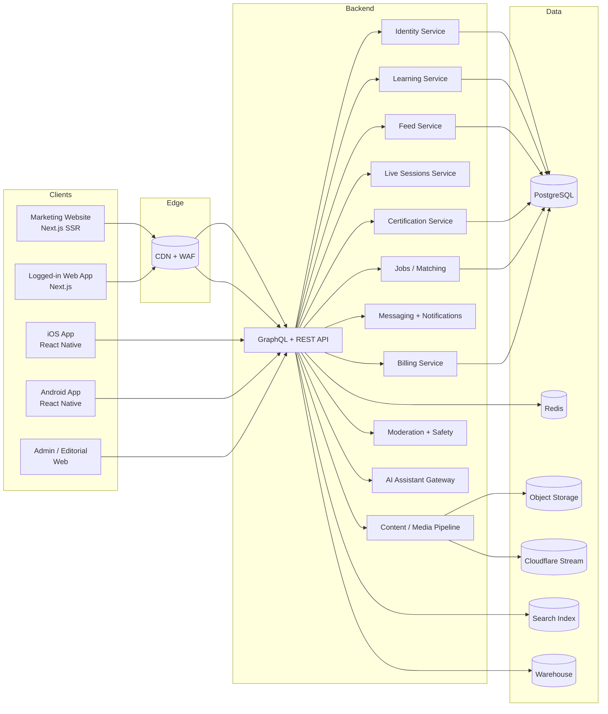

# SkillRise — Technical Requirements (TRD)

**Companion to:** `BUSINESS_REQUIREMENTS.md` v2.0
**UI source of truth:** `../skillrise-platform-website.html`
**Version:** 2.0
**Principle:** Website and mobile app share **one identity**, **one content model**, **one API contract**. Web surfaces and native app are **peer clients** of the same backend.

---

## 1. System context

---

## 2. Stack decisions

| Concern | Choice | Rationale |
|--------|--------|-----------|
| Marketing website | **Next.js (App Router) + React Server Components**, Tailwind CSS, served via Vercel or Cloudflare Pages | SSR/SEO, edge caching, identical DOM/CSS to the provided HTML, incremental static for marketing pages |
| Logged-in web | Same Next.js app, gated routes, SWR/React Query | Shared tokens + component library |
| Mobile | **React Native (Expo)**, TypeScript, Reanimated, Zustand + React Query | Single codebase, offline SQLite, near-parity components with web |
| API | **GraphQL** (Apollo Server or Yoga) as primary, REST gateway for webhooks/legacy | Mobile efficient fetching; strongly typed schema shared with clients |
| Backend runtime | Node.js 22 LTS (TypeScript) | Team skill, JS parity across stack |
| DB | **PostgreSQL 16** + Redis (cache, presence, rate limits) | Relational richness for learning/jobs; Redis for feed ordering + live session state |
| Search | **Meilisearch or OpenSearch** | Fast track/feed/jobs search, facets |
| Video | **Cloudflare Stream** for uploads, adaptive streaming, captions | Cheap global CDN, captions pipeline |
| Live sessions | **LiveKit** (WebRTC SFU) with server-side recording to Cloudflare Stream | Open-source, scalable, records can repost as feed content |
| Notifications | FCM (push) + APNs + Twilio (SMS) | Cross-platform + SMS fallback |
| Payments | **Stripe** (employer subs + success-fee invoicing) | Tax compliance, invoices, revenue-recognition ready |
| Credentials | **Open Badges 3.0 (W3C Verifiable Credentials)**, Ed25519 signing, optional blockchain anchor | Industry-standard, verifiable, tamper-proof |
| Auth | **OAuth 2.1 + OIDC (Auth.js / Clerk / Auth0)**; PKCE for mobile | Secure tokens, social logins |
| AI | **Anthropic Claude API** behind internal AI Gateway (budgeting, PII redaction, caching) | Study assistant, matching, moderation assistance |
| Observability | OpenTelemetry → Grafana Cloud (logs, traces, metrics), Sentry for errors | Full-stack traceability |
| IaC | Terraform + GitHub Actions | Reviewable infra |
| Hosting | AWS primary (us-east-1 / us-west-2 for multi-AZ), Cloudflare edge | Scalability, region flexibility |

---

## 3. Domain model (logical)

Tables are logical; naming in code and DB matches the product glossary.

| Entity | Key fields | Notes |
|--------|-----------|-------|
| `User` | id, auth_ids[], roles[], neighborhood_id, dob, consent_flags, id_verified_at | **Roles are additive**: learner / teacher / employer_admin / school_admin / platform_admin |
| `Neighborhood` | id, city, lat/lng, metadata | Used for matching & cohorts |
| `SkillTrack` | id, title, category, min_age, duration_weeks, status, tags, local_demand_score | Categories map to site tiles |
| `Module` | id, track_id, order, type(video/text/quiz/practical), content_ref | |
| `Enrollment` | id, user_id, track_id, started_at, progress_json, offline_cached_at | Progress syncs across devices |
| `Cohort` | id, track_id, neighborhood_id, start_at, member_ids[] | |
| `Lesson` (SkillFeed) | id, teacher_id, title, short_description, video_ref, duration_s, age_rating, status, moderation_ref | Feed unit |
| `LiveSession` | id, teacher_id, track_id(optional), scheduled_at, neighborhood_scope, recording_ref | |
| `Assessment` | id, track_id, quiz_schema, practical_schema, pass_threshold | |
| `AssessmentAttempt` | id, user_id, assessment_id, score, practical_submission_ref, passed_at, cooldown_until | |
| `Certificate` | id, user_id, track_id, credential_id(public), issued_at, signature, revocation_status, vc_payload_uri | Open Badges 3.0 |
| `Job` | id, employer_id, required_tracks[], neighborhood_id, title, wage_range, status, created_at | |
| `Application` | id, job_id, user_id, submitted_at, status, messages_ref, interview_refs[] | |
| `Hire` | id, application_id, started_at, thirty_day_mark, ninety_day_mark, success_fee_status | |
| `Pledge` | id, user_id, signed_at, commitments_json | Public signer counter is aggregate |
| `Challenge30d` | id, user_id, started_at, streak_count, last_session_at, completed_at | |
| `EmployerOrg` | id, name, verification_status, subscription_id, address | |
| `School` | id, name, district, admin_user_id, roster_ids[] | |
| `SubscriptionInvoice` | standard Stripe mirror | |
| `ModerationItem` | id, subject_ref(polymorphic), reason, state, reviewer_id | |

Derived / analytics:
- `ScrollingReplacedSeconds(user)` — sum of active-learning seconds while app is foregrounded.
- `ImpactAttribution(teacher)` — hires whose path of learning intersects teacher’s lessons.

---

## 4. API contract

### 4.1 Conventions
- **Schema-first GraphQL** (SDL in a shared `@skillrise/schema` package; generates TS types + RN hooks + web hooks).
- REST used only for webhooks (Stripe, LiveKit, Cloudflare Stream) and public credential verification (cacheable).
- All IDs are opaque strings (ULIDs).
- **Versioning:** schema is additive; breaking changes gated by `@deprecated` + feature flags.
- **Errors:** standard error `code` (e.g. `UNAUTHORIZED`, `AGE_RESTRICTED`, `CERT_COOLDOWN`) + HTTP 4xx mapping.
- **Pagination:** cursor-based (Relay-style).
- **Rate limits:** per-user-per-route via Redis token bucket; response headers include remaining budget.
- **Idempotency:** `Idempotency-Key` header for any mutation with payment or credential side-effects.

### 4.2 Representative operations (per BR area)

> Full schema lives in `packages/schema`. Names below stay stable for mobile and web.

| BR area | Key operations |
|---------|----------------|
| BR-PLAT-001..003 (Identity) | `signUp`, `signIn`, `linkSocial`, `chooseNeighborhood`, `addRole`, `getMe` |
| BR-LEARN (Learning) | `listTracks`, `enroll`, `getModule`, `updateProgress`, `joinCohort`, `listMyCohorts` |
| BR-FEED (SkillFeed) | `feed(cursor, ageFilter)`, `likeLesson`, `commentOnLesson`, `reportLesson`, `dailyLimitStatus` |
| BR-TEACH | `uploadLessonDraft`, `submitLessonForReview`, `scheduleLive`, `startLive`, `endLive`, `teacherDashboard` |
| BR-CERT | `startAssessment`, `submitQuiz`, `submitPractical`, `getCertificate`, `publicVerify(credentialId)` (REST) |
| BR-JOBS | `matchedJobs`, `applyOneTap`, `listApplications`, `sendMessage`, `scheduleInterview` |
| BR-YOUTH | `enterYouthZone`, `listYouthTracks`, `startChallenge30d`, `recordChallengeProgress` |
| BR-PLEDGE | `signPledge`, `pledgeCounters` |
| BR-EMP | `postJob`, `listApplicants`, `verifyBusiness`, `subscribe`, `onHireConfirmed` |
| BR-SCHOOL | `createClass`, `rosterImport`, `assignTrackToClass`, `classDashboard` |
| BR-ADMIN | `reviewLesson`, `approveTrack`, `flagItem`, `analyticsQuery` |

### 4.3 Realtime
- **SkillFeed**: cursor + periodic refresh; like/comment counters via server-sent events.
- **Live sessions**: LiveKit room tokens minted by backend; WebRTC direct to SFU.
- **Messaging**: WebSockets via API gateway with Redis pub/sub.
- **Notifications**: FCM/APNs push; SMS fallback for job match if push disabled.

---

## 5. Authentication & authorization

| Requirement | Detail |
|-------------|--------|
| Providers | Email+password, phone OTP, Google, Apple |
| Session (web) | HttpOnly, Secure, SameSite=Lax cookies; refresh rotation on sliding window |
| Session (mobile) | Access + refresh in Keychain / Keystore; PKCE OAuth for social |
| RBAC | Role list on `User` (`learner, teacher, employer_admin, school_admin, platform_admin`); every mutation checks role + ownership server-side. Guardrails tested with policy-as-code (OPA) in CI |
| Minors (13–17) | Distinct scopes: cannot receive DMs from adult strangers; adult teachers cannot initiate 1:1 chats; guardian-consent flag required where jurisdiction demands |
| Employer org scoping | Org-scoped tokens; row-level security on every employer query |
| School scoping | FERPA-compatible: student records siloed per school; no cross-school queries |

---

## 6. Data, storage, retention

| Class | Store | Retention | Notes |
|-------|-------|-----------|-------|
| Relational core | PostgreSQL | Indefinite | Daily encrypted snapshots; PITR 7 days |
| User PII | PG with column-level encryption | Purge 30 days after account deletion | KMS-backed keys |
| ID verification photos | S3 (private) | Delete immediately after issuance confirmed | Never exposed to clients after verification |
| Lesson video | Cloudflare Stream | While lesson live + 180 d after unpublish | Captions required before publish |
| Live recordings | Cloudflare Stream | Teacher-controlled; default 90 d | Can promote to published Lesson |
| Offline cached modules (device) | Expo-SQLite + encrypted FS | While enrolled | Wipe on logout |
| Messaging | PG + S3 for attachments | 2 years default | User export on request |
| Analytics events | Segment / Snowplow → warehouse | 5 years | PII-light event schema |
| Credentials payloads | PG + static JSON-LD at `/.well-known/credentials/{id}` | Indefinite | Signed, publicly verifiable |

Migrations forward-only; PR-checked; safe-deploy window documented.

---

## 7. Marketing website alignment with provided HTML

The provided `skillrise-platform-website.html` is the design spec. In production we port it to Next.js components without visual regression.

### 7.1 Design tokens (extract from provided CSS variables)

| Token | Value | Use |
|-------|-------|-----|
| `--g` | `#1fc87e` | Primary accent (green) |
| `--gd` | `#0c6b44` | Darker green |
| `--gl` | `rgba(31,200,126,.1)` | Soft accent bg |
| `--ink` | `#06080d` | App background |
| `--s1..s4` | `#0c1018 / #121820 / #1a2230 / #222c3c` | Surfaces |
| `--t1..t3` | `#edf2ff / #8a98bc / #465070` | Text primary/secondary/tertiary |
| `--amber` | `#f5a623` | Teacher accent |
| `--red` | `#e84343` | Before / warning |
| `--blue` | `#4a8ef5` | Info / learner secondary |
| `--purple` | `#9b6cf5` | Youth Zone / Pledge |
| `--border` / `--border2` | `rgba(255,255,255,.07 / .13)` | Dividers |
| `--r` / `--rl` | `14px / 20px` | Radii |
| Fonts | `Syne` (display), `DM Sans` (UI), `JetBrains Mono` (mono) | |

All tokens exported to a shared `tokens.json` consumed by web (Tailwind preset) and app (Restyle theme).

### 7.2 Component mapping (web → RN)

| Website class | Web component | RN component | States |
|---------------|---------------|--------------|--------|
| `.nav`, `.mmenu` | `<Nav>`, `<MobileMenu>` | N/A (app has native tabs) | sticky/scrolled/open |
| `.btn .bp / .bg / .btn-xl / .btn-sm` | `<Button variant primary|ghost size xl|md|sm>` | same | default/hover/pressed/disabled/loading |
| `.stag` (eyebrow) | `<SectionTag>` | `<SectionTag>` | — |
| `.sh`, `.ss`, `.h1` | `<SectionHeading>`, `<SectionSub>`, `<Hero>` | same | — |
| `.phone-frame` / `.fb*` | `<PhoneMockup>` with floating badges | N/A | animated float |
| `.mv-item`, `.ii` | `<StatItem>` | `<StatItem>` | — |
| `.aud-card` | `<AudienceCard variant=learner|teacher|youth>` | N/A | hover lift |
| `.tf-step` | `<TeachFlowStep>` | N/A | — |
| `.sf-card` | `<FeedCardPreview>` | `<FeedCard>` real | hover |
| `.tcard` | `<TestimonialCard>` | same | — |
| `.pc-row` / `.pc-cb` | `<PledgeRow>` + `<Checkbox>` | same | checked/unchecked |
| `.sbadge` | `<StoreBadge store=apple|google>` | N/A | — |

### 7.3 Breakpoints
Match HTML: `900px` (layout stack), `768px` (mission/pledge stack), `560px` (movement wrap).

### 7.4 Performance budgets (marketing)

| Metric | Target |
|--------|--------|
| LCP (hero) | ≤ 2.0 s on 4G |
| CLS | ≤ 0.02 |
| INP | ≤ 200 ms |
| JS shipped to marketing route | ≤ 90 KB gz after tree-shaking |
| Hero image/phone-mockup | pure CSS/SVG, no bitmap |

### 7.5 SEO
- Per-section anchors preserved: `#mission, #teach, #youth, #stories, #pledge, #employers, #download`.
- `sitemap.xml`, `robots.txt`, OG/Twitter cards for each landing.
- JSON-LD: `Organization`, `FAQPage` for pledge, `Course` per Skill Track (when tracks get static landing pages).
- Canonical URLs; locale alternates (`en`, `es`).

### 7.6 Motion & accessibility
- Preserve `float`, `fadeUp` animations; respect `prefers-reduced-motion` (disable).
- Contrast check: green `#1fc87e` on `#06080d` passes AA; verify `--t3` on dark backgrounds meets 4.5:1 for body copy — adjust tokens where it doesn’t.

---

## 8. App (React Native) requirements

| Requirement | Detail |
|-------------|--------|
| **Navigation** | Bottom tabs mirror phone mockup: Feed, Learn, Teach, Youth, Jobs |
| **Offline** | SQLite cache for enrolled modules; signed download URLs; background sync |
| **Push** | FCM + APNs; categories: jobs, messages, reminders, live-start |
| **Media** | Native video player with DRM optional; caption track mandatory |
| **Live** | LiveKit RN SDK; low-bandwidth mode for hosts |
| **Recording (teacher)** | Camera capture → upload queue → progress visible → editorial status |
| **Age gating** | Enforced client-side **and** server-side; Youth mode visually indicated |
| **Daily limit** | Client tracks foreground SkillFeed time; server authoritative; soft block at limit, reminder modal |
| **Deep links** | `skillrise://track/{id}`, `/lesson/{id}`, `/live/{id}`, `/cert/{credentialId}` + Universal Links / App Links |
| **Biometric lock (optional)** | For certificates wallet |

---

## 9. Safety, trust, integrity

| Control | Implementation |
|---------|----------------|
| Youth Zone isolation | Separate content graph + moderation queue; adult↔minor DM blocked at API |
| Teacher vetting | Sign-up + editorial review + (for trades/youth-facing) background-check partner |
| Lesson moderation | Automated (AI prechecks for profanity, policy violations) + human review before publish |
| Live moderation | Operator tools: pause, kick, end; recordings kept for abuse investigation |
| Identity verification | Third-party IDV (e.g. Persona/Stripe Identity) before certificate issuance |
| Credential integrity | Ed25519 signed Open Badges 3.0 JSON-LD; publicly resolvable URL; revocation list |
| Employer verification | Business registry check + domain/email verification + manual review |
| Fraud | Device-fingerprint + velocity rules on sign-ups, cert attempts, applications |
| Safety reporting | In-product report on every user-generated surface; SLA in BRD §9 |

---

## 10. Security

| Area | Requirement |
|------|-------------|
| Transport | TLS 1.3 only; HSTS preload |
| Headers | CSP (self, fonts.googleapis, stream.cloudflare, stripe, livekit), X-Frame-Options DENY, Referrer-Policy strict-origin |
| Secrets | AWS Secrets Manager / Doppler; no secrets in client; per-env KMS keys |
| Input | Strict schema validation (Zod) on every API entry point |
| Dependencies | Renovate + Snyk/CVE scanning gate in CI |
| Webhooks | Signature verification + replay protection on Stripe, LiveKit, Cloudflare |
| Privacy | GDPR + CCPA subject-access and deletion endpoints; DSR SLA 30 days |
| Pen testing | Annual third-party pen test; quarterly internal |
| Data encryption | AES-256 at rest; KMS-managed keys; column-level encryption for PII |
| Logging | No raw PII in logs; structured logs with request IDs and anonymized user IDs |

---

## 11. Observability

| Signal | Tool | Coverage |
|--------|------|----------|
| Traces | OTel → Grafana Tempo | Every GraphQL resolver + outbound call |
| Metrics | OTel → Prometheus/Grafana | RED metrics per service; business metrics (enrollments/hour, pledge signups/min) |
| Logs | Loki | Per-request ID; PII-redacted |
| Errors | Sentry (web + RN + server) | Source maps + release tagging |
| Product analytics | Segment → Snowplow + warehouse | Event schema versioned in repo |
| Dashboards | Grafana | SLO dashboards per service |
| Alerting | PagerDuty | On-call rotations; runbooks per alert |

SLOs (initial):
- API p95 latency ≤ 300 ms in-region; ≤ 500 ms global.
- Availability ≥ 99.9% monthly per service; 99.95% for auth + certificate verification.
- Media start time p75 ≤ 3 s.

---

## 12. Quality, CI/CD, environments

| Practice | Detail |
|----------|--------|
| Envs | `dev`, `preview (per PR)`, `staging`, `prod`; no prod PII in lower envs |
| Testing | Jest (unit) + contract tests against GraphQL schema + Playwright (web E2E) + Detox (RN E2E) covering BR flows §5.1–§5.5 |
| Lint/format | ESLint + Prettier + TypeScript strict + eslint-plugin-security |
| CI gates | typecheck, tests, schema diff, a11y (axe), bundle size, dependency scan |
| CD | Preview deploys for every PR; staging auto on `main`; prod on release tag; canary 10% → 100% |
| Feature flags | LaunchDarkly or OpenFeature; every new BR ships behind a flag |
| Rollback | One-command rollback; DB migrations designed reversible or dual-write windows |

---

## 13. App readiness checklist (so website v1 doesn’t block app v1)

- [x] Authentication flows are API-first (no web-only session magic). 
- [x] Media delivered via signed URLs, not scraped pages.
- [x] Deep link scheme reserved; universal/app-link domains documented.
- [x] Push notification device registration endpoint planned.
- [x] Offline caching spec for modules.
- [x] GraphQL schema + SDK generation set up from day one.
- [x] Design tokens exported for shared theming.
- [x] Analytics event schema agnostic to client platform.
- [x] Public credential verification URL (works from any client, including shareable by learner).
- [x] Age-gating checks duplicated server-side (never trust client for Youth).

---

## 14. Traceability — epics → BR → technical ownership

| Epic | BR IDs | Services | Clients |
|------|--------|----------|---------|
| Marketing site | BR-MKT-001..015 | static hosting, edge cache | Web |
| Identity | BR-PLAT-001..003, AUTH | Auth svc, PG | Web + App |
| Learning | BR-LEARN-001..004 | Learning svc, Content pipeline, PG, CF Stream | Web + App |
| SkillFeed | BR-FEED-001..003, BR-LIVE | Feed svc, Live svc (LiveKit), Moderation | App primary, Web read-only |
| Teacher tools | BR-TEACH-001..004 | Content pipeline, Moderation | App + Web |
| Certification | BR-CERT-001..006 | Certification svc, IDV provider, public verify endpoint | Web + App |
| Jobs & Hiring | BR-JOBS-001..005 | Jobs svc, Messaging, Search | Web + App |
| Youth & Challenge | BR-YOUTH-001..004, BR-PLEDGE-002 | Feed scopes, Challenge svc | App primary |
| Pledge | BR-PLEDGE-001 | Pledge svc (simple counter service) | Web + App |
| Employer | BR-EMP-001..005 | Jobs svc, Billing (Stripe), Verification | Web |
| Schools | BR-SCHOOL-001..002 | Schools svc, rostering | Web |
| Admin / Editorial | BR-ADMIN-001..003 | Moderation, Analytics | Web (internal) |

---

## 15. Open technical questions

1. LiveKit self-hosted vs. LiveKit Cloud at what scale does migration happen.
2. Open Badges issuer DID — do.xyz style or co-issued with accreditation partner per BR §14 open q 2.
3. School rostering: OneRoster (Clever) vs. direct CSV import for v1.
4. AI costs: cache Claude responses by question fingerprint; quota per user per day.
5. Live recording default: store first, publish on teacher opt-in; storage cost model.
6. Anti-abuse on Pledge signer counter (rate-limit + captcha + IP reputation).
7. Offline cert verification — bundle signed JWT in QR for offline scan?
8. Payment flows for employer success-fee: auto-charge vs. invoice with terms.
